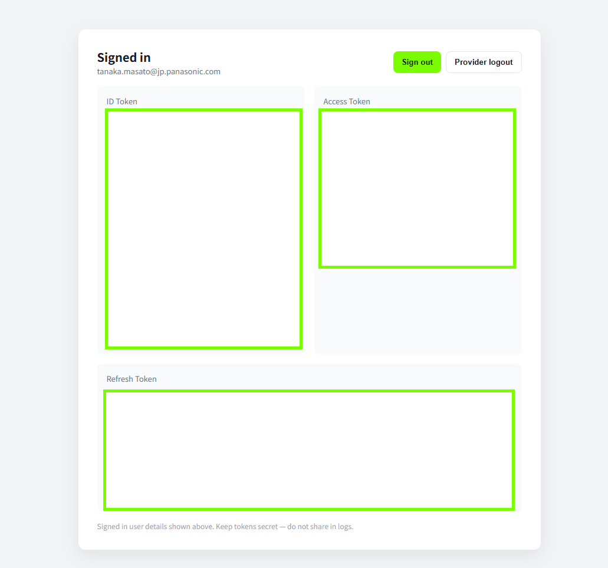

# React + TypeScript + Vite

## SSO Login Example


### SSO Sucess Example



## Run Docker App

1. build and run the Docker container

```bash
npm run build
docker build -t sso-sample-app .
docker run -p 5174:80 sso-sample-app
```

2. access to `http://localhost:5173`

3. upload docker image to ECR and deploy to ECS

```bash
aws ecr create-repository --repository-name sso-sample-app-repository --profile pcms-dev
aws ecr get-login-password --region ap-northeast-1 --profile pcms-dev | docker login --username AWS --password-stdin 463470975657.dkr.ecr.ap-northeast-1.amazonaws.com
```

`your-account-id.dkr.ecr.ap-northeast-1.amazonaws.com` is your AWS account ID.

```bash
docker tag sso-sample-app:latest 463470975657.dkr.ecr.ap-northeast-1.amazonaws.com/sso-sample-app-repository:v1.0.2
docker push 463470975657.dkr.ecr.ap-northeast-1.amazonaws.com/sso-sample-app-repository:v1.0.2
```

4. deploy to ECS Fargate from ECR image

```bash
mkdir my-fargate-app
cd my-fargate-app
npm install aws-cdk
npx cdk init app --language=typescript
npm install @aws-cdk/aws-ecs @aws-cdk/aws-ecs-patterns @aws-cdk/aws-ecr @aws-cdk/aws-iam @aws-cdk/aws-ec2 @aws-cdk/core
```

create a cdk stack

```typescript
// lib/my-fargate-app-stack.ts
import * as cdk from "@aws-cdk/core";
import * as ec2 from "@aws-cdk/aws-ec2";
import * as ecs from "@aws-cdk/aws-ecs";
import * as ecsPatterns from "@aws-cdk/aws-ecs-patterns";

export class MyFargateAppStack extends cdk.Stack {
  constructor(scope: cdk.Construct, id: string, props?: cdk.StackProps) {
    super(scope, id, props);

    // VPCの作成
    const vpc = new ec2.Vpc(this, "MyVpc", {
      maxAzs: 2, // 可用性ゾーンの数
    });

    // ECSクラスターの作成
    const cluster = new ecs.Cluster(this, "MyCluster", {
      vpc,
    });

    // Fargateサービスの作成
    const fargateService =
      new ecsPatterns.ApplicationLoadBalancedFargateService(
        this,
        "MyFargateService",
        {
          cluster,
          taskImageOptions: {
            image: ecs.ContainerImage.fromRegistry(
              "your-account-id.dkr.ecr.your-region.amazonaws.com/your-repo-name:latest"
            ),
            containerPort: 80,
          },
        }
      );

    // セキュリティグループの設定（必要に応じて）
    fargateService.service.connections.allowFromAnyIpv4(
      ec2.Port.tcp(80),
      "Allow HTTP traffic"
    );
  }
}
```

---

This template provides a minimal setup to get React working in Vite with HMR and some ESLint rules.

Currently, two official plugins are available:

- [@vitejs/plugin-react](https://github.com/vitejs/vite-plugin-react/blob/main/packages/plugin-react) uses [Babel](https://babeljs.io/) for Fast Refresh
- [@vitejs/plugin-react-swc](https://github.com/vitejs/vite-plugin-react/blob/main/packages/plugin-react-swc) uses [SWC](https://swc.rs/) for Fast Refresh

## Expanding the ESLint configuration

If you are developing a production application, we recommend updating the configuration to enable type-aware lint rules:

```js
export default defineConfig([
  globalIgnores(["dist"]),
  {
    files: ["**/*.{ts,tsx}"],
    extends: [
      // Other configs...

      // Remove tseslint.configs.recommended and replace with this
      tseslint.configs.recommendedTypeChecked,
      // Alternatively, use this for stricter rules
      tseslint.configs.strictTypeChecked,
      // Optionally, add this for stylistic rules
      tseslint.configs.stylisticTypeChecked,

      // Other configs...
    ],
    languageOptions: {
      parserOptions: {
        project: ["./tsconfig.node.json", "./tsconfig.app.json"],
        tsconfigRootDir: import.meta.dirname,
      },
      // other options...
    },
  },
]);
```

You can also install [eslint-plugin-react-x](https://github.com/Rel1cx/eslint-react/tree/main/packages/plugins/eslint-plugin-react-x) and [eslint-plugin-react-dom](https://github.com/Rel1cx/eslint-react/tree/main/packages/plugins/eslint-plugin-react-dom) for React-specific lint rules:

```js
// eslint.config.js
import reactX from "eslint-plugin-react-x";
import reactDom from "eslint-plugin-react-dom";

export default defineConfig([
  globalIgnores(["dist"]),
  {
    files: ["**/*.{ts,tsx}"],
    extends: [
      // Other configs...
      // Enable lint rules for React
      reactX.configs["recommended-typescript"],
      // Enable lint rules for React DOM
      reactDom.configs.recommended,
    ],
    languageOptions: {
      parserOptions: {
        project: ["./tsconfig.node.json", "./tsconfig.app.json"],
        tsconfigRootDir: import.meta.dirname,
      },
      // other options...
    },
  },
]);
```
